# [Webinar] Storage Formats (by Sebastien Gardoll from ipsl)

Links:

- https://gitlab.in2p3.fr/ipsl/espri/espri-ia/projects/storage_formats
- https://ipsl.pages.in2p3.fr/formations/jupyter-notebooks-examples/engineering/storage_formats_for_floats.html

### Use Case

- very large dataset for Deep Learning
  - too big to be loaded in the RAM
  - costly online data extraction
  - numeric f32 or f64 multidim matrices
  - training dataset is read multiple time duting training epoch
  - look for a storage format that:
    - random read of chunks
    - sequentially read randomly selected partitions (less entropy)
- common:
  - dataset size quota and data ingress ⇒ compress data
  - file number quota ⇒ concatenate files (tar)
  - minimize read/write time (IO overhead)

⇒ Abstraction:

- **chunks by chunks** case: 1 chunk = 1 file (files can be concatenated into one file tar/zip)
- **partitions by partitions** case: 1 partition = 1file; storage format provides chunk access

### Python storage formats landscape

- Multi-dim and self descriptive low level storage formats for num data:
  - Numpy
  - HDF5
  - Zarr
  - Parquet, tiff, …
- Frameworks with geospatial support:
  - NetCDF4: NetCDF4 ⇒ HDF5
  - Xarray
  - NCZarr
  - Geotiff, …
- Databases with geospatial support:
  - postGIS over postgreSQL
  - …

#### Data Selection

Abstraction level not equivalent:

- HDF5 & numpy: file level
  - select file, open the file, select data (slice/concat), close file
- Zarr: dataset level
  - open dataset, slice: load in RAM the chunks containing the selected data

#### Chunking

- Concepts:
  - File based chunking: 1 chunk = 1 file. The whole file is loaded into RAM
  - Chunking within a file or N chunks grouped into 1 file. Only the chunk is loaded into RAM
  - Chunk shape is critical for io performances: depend on application
- in numpy:
  - File based chunking straight-forward (chunk/file selection left up to the user)
  - Chunking within file with mmap but low level (byte offset management left up to the user)
- in HDF5:
  - File based chunking straight-forward (chunk/file selection left up to the user)
  - Chunking within file: offsetted sequential read of chunks is supported but random read
- in Zarr:
  - Designed on file based chunking
  - Provided indexed array like numpy ⇒ random read made easy

#### Features:

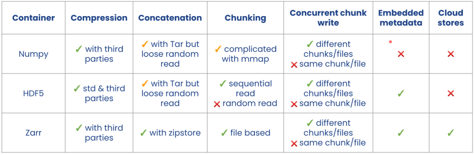

### Experiment

#### Blosc (meta-compressor)

- NOT a compression codec
- Available for C & Python (wrapper)
- More info at: https://www.blosc.org/

#### Method

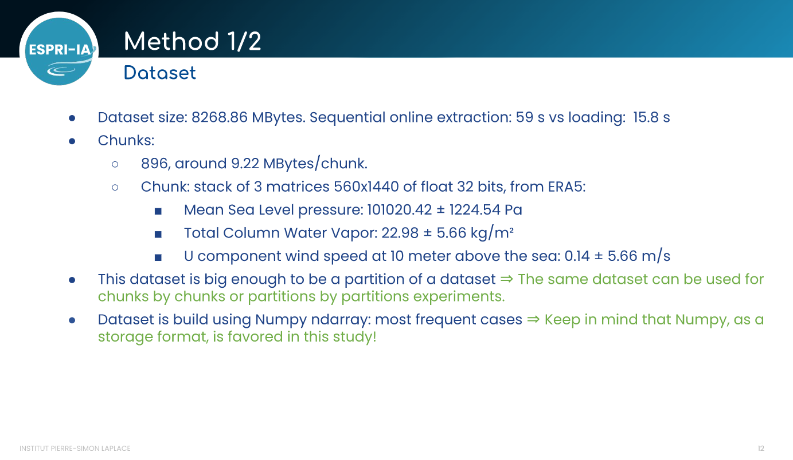
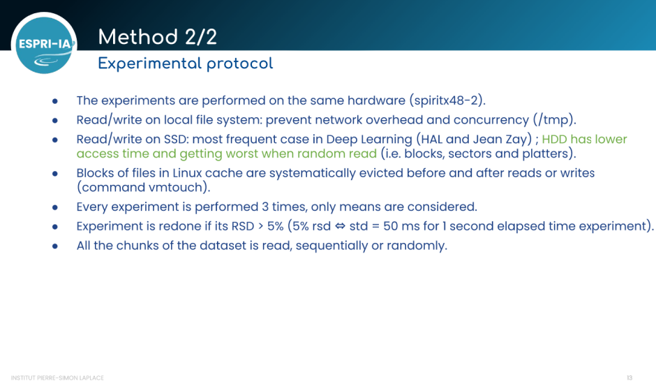

#### Results:

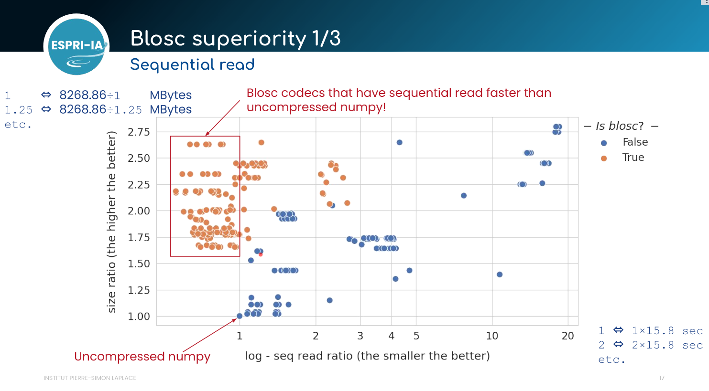
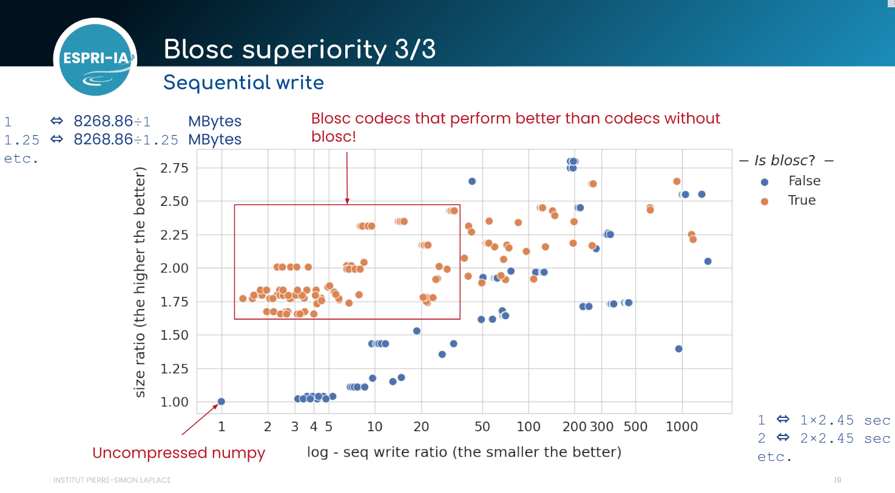
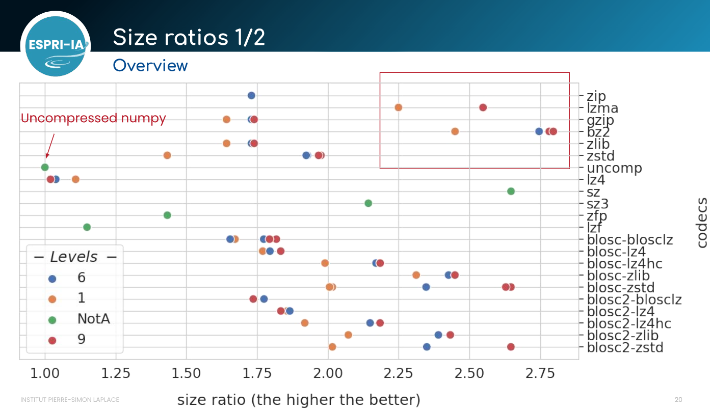
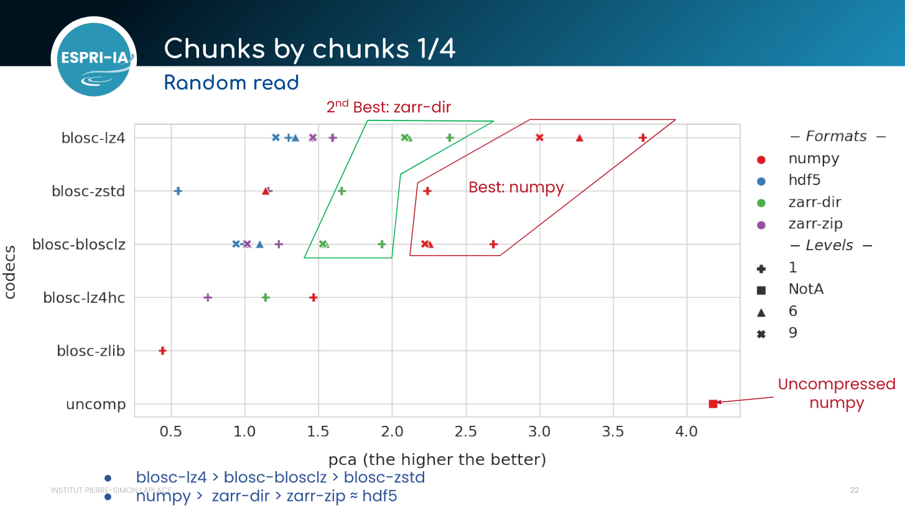
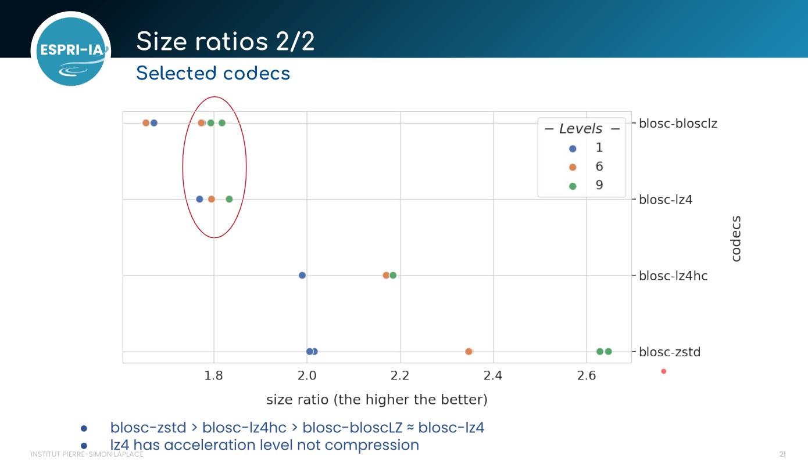
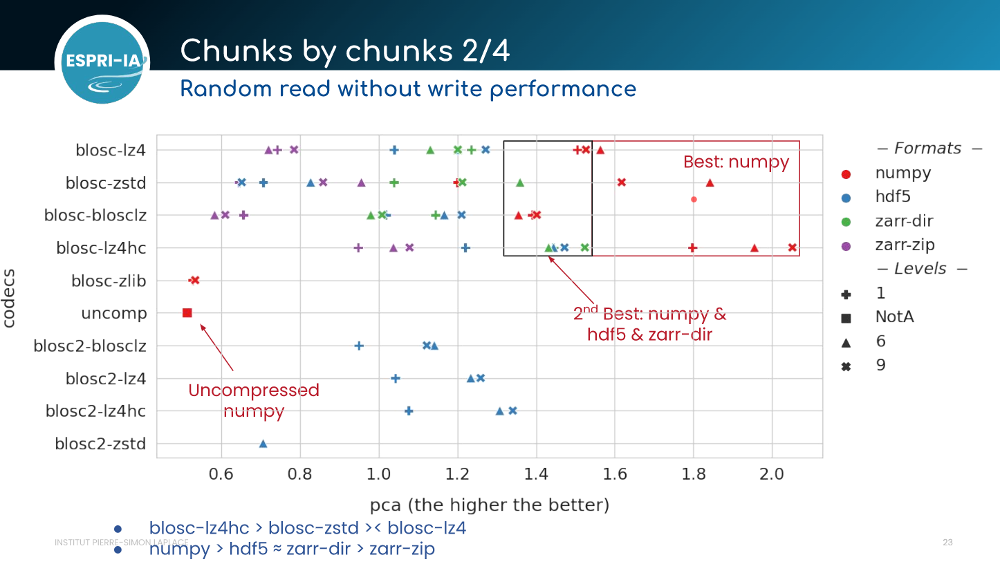
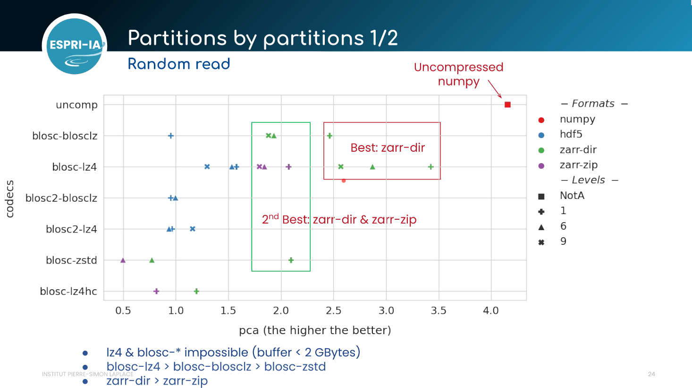
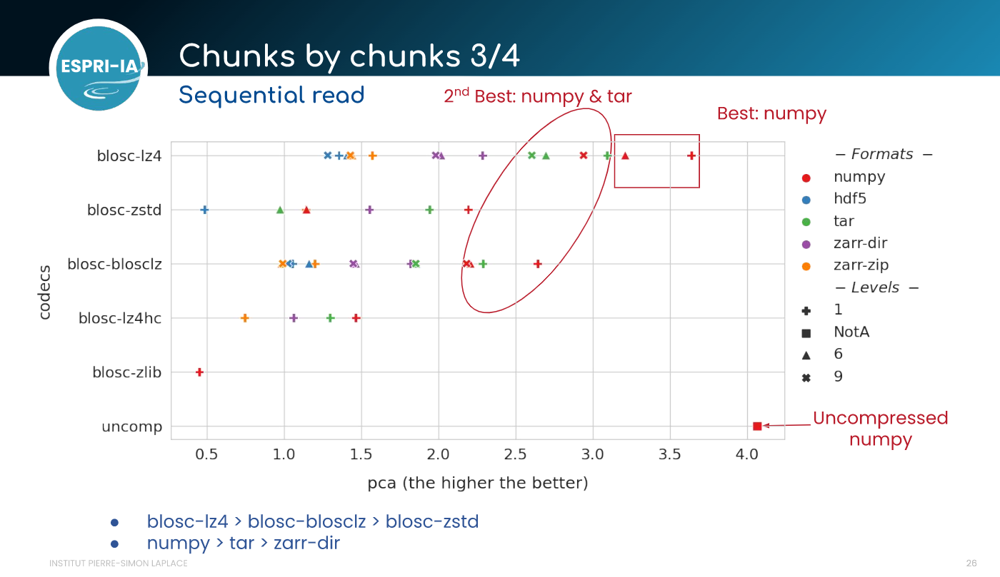
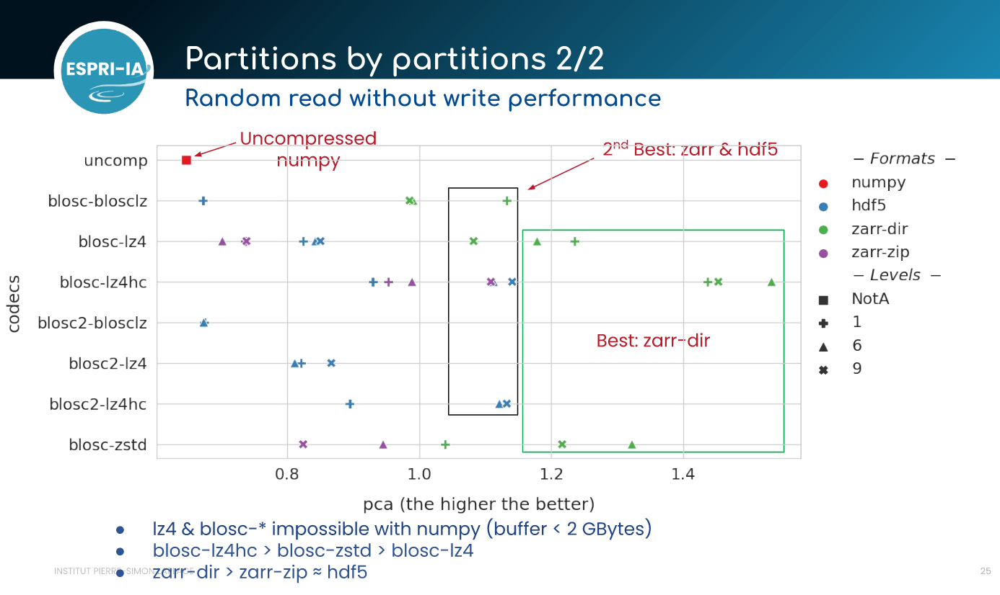
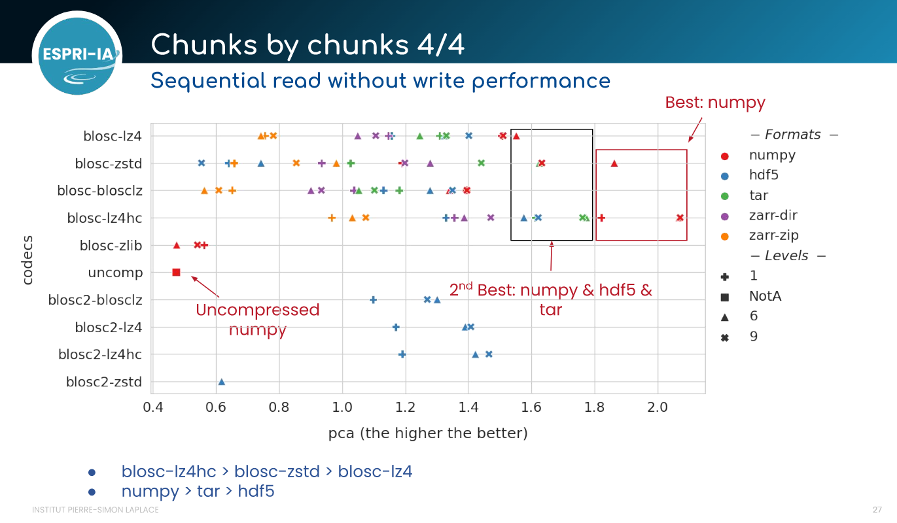

#### Conclusions

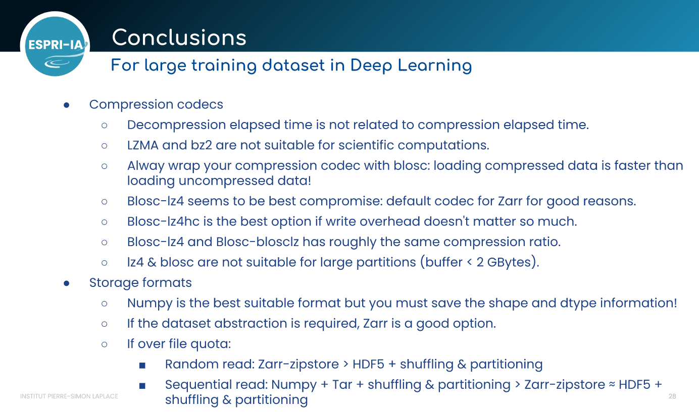

#### Perspectives

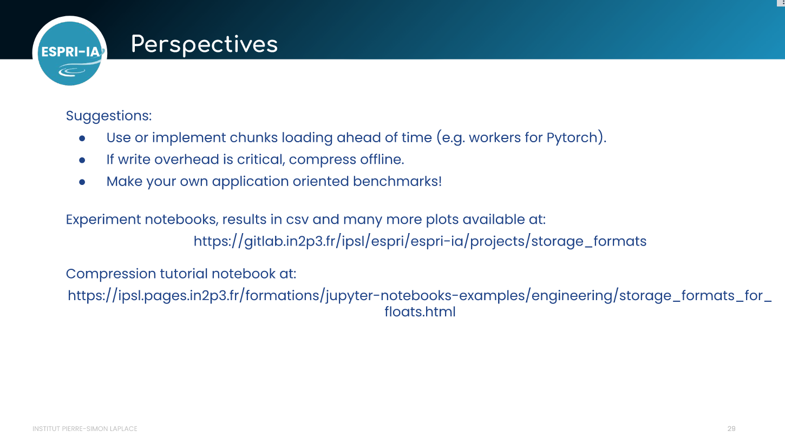
